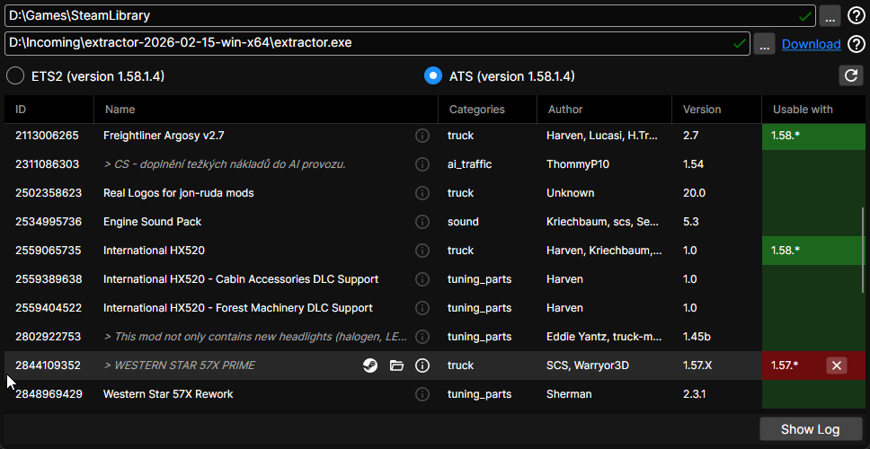

This tool allows temporarily removing the version restriction from Steam Workshop mods for the games _Euro Truck Simulator 2_ and _American Truck Simulator_ by [SCS Software](https://www.scssoft.com), to allow activating them after game updates when the mod authors 
have not yet declared them compatible. This is useful e.g. when mod authors don't release updates for Open Betas, or take some time after a full game update release. Only a relatively small proportion of mods appears to have version restrictions in the first place.

It shows a list of your Steam Workshop mods for each game with the respective version restrictions, if any, and lets you temporarily remove the restriction for mods that cannot be activated with the current version. This will stay until each mod is updated, after which the old version restriction should be removed anyway. 
You may have to restart your game, or at the very least reopen the mod manager, after unblocking mods.

You can also open a mod's directory and Steam Workshop page from here.

Important:
- **This does not change the actual mods in any way.** Mods that are _technically_ incompatible won't work and may crash the game or break your save game, just like any outdated mod that has no version restriction in the first place. Many mods aren't often broken by game updates, but there is never a guarantee that they will continue to work.
- This only works for mods installed through the Steam Workshop. It knows nothing about the manually installed mods in your game data folder.
- This does nothing you couldn't do manually; it just saves you the hassle of finding the mod directories in the forest of numbers, and is a bit faster if you need to unblock multiple mods.
- The intended purpose for this is bridging the few weeks - at most - until a mod author updates their mod after a game update. The older the mods are that you reenable, the higher the risk for instabilities - again, as with any older mods. 

The HashFS extractor is not required for mod unblocking to work, but is needed to read detail information from some mods and find the installed game versions. Once downloaded and selected, you won't notice it working.

Light and dark theme are supported but can currently not be selected manually; instead, the theme follows the system theme.

Note:
- There are some older mods with a differently formatted versions file that the parser currently cannot read. These will show errors in the log and not appear in the mod list, but they shouldn't have version restrictions anyway.
